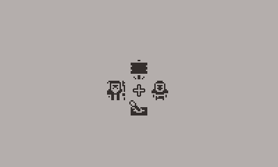

# pdDialogue

a Playdate dialogue system



## Getting Started

If you don't need any styles, it's *very* easy to get started. The library comes with some defaults to get working out of the box:

```lua
import "CoreLibs/object"
import "CoreLibs/graphics"

import "pdDialogue"

pdDialogue.say("Hello, World!")

function playdate.update()
    pdDialogue.update()
end
```

Check out the [wiki](https://github.com/PizzaFuel/pdDialogue/wiki) for more in-depth documentation :)

Example image assets are from [Kenney's 1-Bit Pack](https://www.kenney.nl/Examples/assets/bit-pack) and the demo fonts are included in the [Playdate SDK](https://play.date/dev/)!
